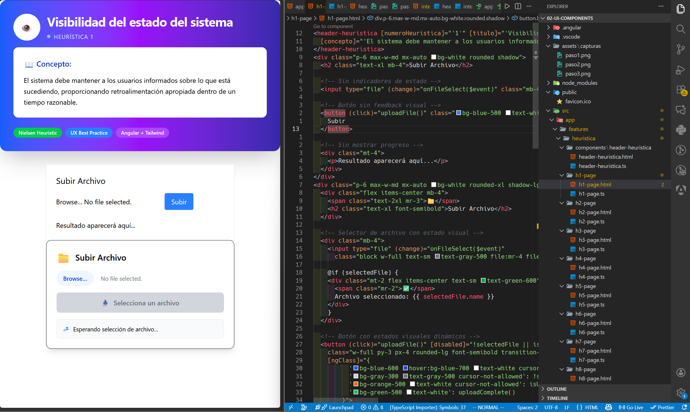
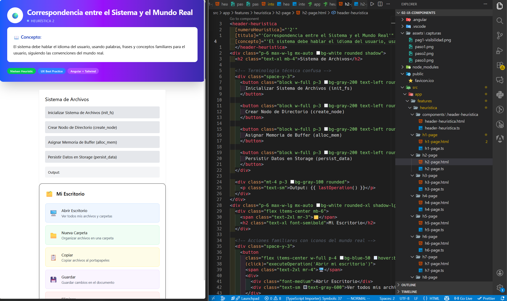

 Programación y Plataformas Web 

# Frameworks Web: Angular con tailwind

### ANGULAR

<div align="center">
  
</div>

### TAILWIND CSS

<div align="center">
  
</div>

## Práctica 1: Heuristica y Manejo de estilos 

### Autor

**Rafael Prieto**  
📧 pprietos@est.ups.edu.ec  
💻 GitHub: [raet0](https://github.com/raet0)

---
## 🎯 ¿Qué son las Heurísticas de Usabilidad?

Las **heurísticas de usabilidad** son principios generales de diseño que describen las propiedades comunes de las interfaces de usuario útiles. Desarrolladas por Jakob Nielsen y Rolf Molich en 1990, estas reglas o "reglas de oro" permiten evaluar y mejorar la experiencia del usuario en sistemas digitales.

### 📈 Contexto Histórico

En los años 90, con el crecimiento de las interfaces gráficas y la computación personal, surgió la necesidad de establecer criterios objetivos para evaluar la calidad de los diseños de interfaz. Nielsen y Molich identificaron patrones recurrentes en interfaces exitosas y los sistematizaron en 10 principios fundamentales.

### 🎨 Importancia en Interfaces Gráficas

Las heurísticas son cruciales porque:
- **Reducen el costo de desarrollo** al identificar problemas temprano
- **Mejoran la satisfacción del usuario** con interfaces más intuitivas
- **Establecen un lenguaje común** entre diseñadores y desarrolladores
- **Proporcionan criterios objetivos** para tomar decisiones de diseño

---

## 🎨 UI vs UX: Conceptos Fundamentales

### 🖼️ **UI (User Interface) - Interfaz de Usuario**

La **UI** se refiere a los elementos visuales e interactivos con los que el usuario interactúa directamente:

- **Elementos visuales**: Botones, menús, iconos, tipografía, colores
- **Componentes interactivos**: Formularios, navegación, animaciones
- **Diseño visual**: Layout, espaciado, jerarquía visual

### 🧠 **UX (User Experience) - Experiencia de Usuario**

La **UX** abarca toda la experiencia que tiene una persona al usar un producto:

- **Investigación del usuario**: Necesidades, comportamientos, objetivos
- **Arquitectura de información**: Organización y estructura del contenido
- **Flujos de usuario**: Cómo navega y completa tareas
- **Usabilidad**: Facilidad de uso y eficiencia

### 🤝 **Cómo las Heurísticas Conectan UI y UX**

| UI (Lo Visual) | Heurística | UX (La Experiencia) |
|----------------|------------|---------------------|
| Botones claros, mensajes de error | Visibilidad del estado | Usuario sabe qué está pasando |
| Iconos universales, terminología familiar | Coincidencia con el mundo real | Navegación intuitiva |
| Atajos de teclado, breadcrumbs | Control y libertad del usuario | Sensación de control |
| Diseño consistente, patrones uniformes | Consistencia y estándares | Curva de aprendizaje reducida |

---

## 🔟 Las 10 Heurísticas de Nielsen: Guía Completa


### 1. 👁️ Visibilidad del Estado del Sistema

#### 📖 **Concepto**
El sistema debe mantener a los usuarios informados sobre lo que está sucediendo, proporcionando retroalimentación apropiada dentro de un tiempo razonable.

#### 🎯 **Ejemplo de Aplicación**
Una barra de progreso durante la carga de un archivo, indicadores de "en línea/desconectado" en aplicaciones de chat, o estados de "guardando..." en editores de texto.

#### 💡 **Consejos para Mejorar**
- Usa indicadores visuales claros (spinners, barras de progreso)
- Proporciona feedback inmediato para acciones del usuario
- Implementa estados de carga y mensajes informativos
- Utiliza animaciones suaves para transiciones

#### ❌ **Ejemplo Mal Aplicado**
```html
<!-- Sin feedback visual -->
<button onclick="submitForm()">Enviar</button>
```
**Problema**: El usuario no sabe si el formulario se está enviando o si debe hacer clic nuevamente.

#### ✅ **Ejemplo Bien Aplicado**
```html
<!-- Con feedback visual claro -->
<button id="submitBtn" onclick="submitForm()">
  <span id="btnText">Enviar</span>
  <span id="spinner" class="hidden">⏳ Enviando...</span>
</button>

<script>
function submitForm() {
  document.getElementById('btnText').classList.add('hidden');
  document.getElementById('spinner').classList.remove('hidden');
  document.getElementById('submitBtn').disabled = true;
}
</script>
```

---

### 2. 🌍 Correspondencia entre el Sistema y el Mundo Real

#### 📖 **Concepto**
El sistema debe hablar el idioma del usuario, usando palabras, frases y conceptos familiares para el usuario, siguiendo las convenciones del mundo real.

#### 🎯 **Ejemplo de Aplicación**
Usar iconos de "carpeta" para directorios, "papelera" para eliminar, o términos como "carrito de compras" en e-commerce.

#### 💡 **Consejos para Mejorar**
- Utiliza metáforas del mundo real (carpetas, archivos, escritorio)
- Emplea terminología familiar para tu audiencia específica
- Organiza la información de forma lógica y natural
- Usa iconos universalmente reconocidos

#### ❌ **Ejemplo Mal Aplicado**
```html
<!-- Terminología técnica confusa -->
<button>Ejecutar proceso de persistencia de datos</button>
<menu>
  <item>Configurar parámetros del sistema</item>
  <item>Inicializar módulos de autenticación</item>
</menu>
```
**Problema**: Lenguaje técnico que confunde a usuarios no técnicos.

#### ✅ **Ejemplo Bien Aplicado**
```html
<!-- Lenguaje natural y familiar -->
<button>💾 Guardar</button>
<menu>
  <item>⚙️ Configuración</item>
  <item>🔐 Iniciar Sesión</item>
</menu>
```

---

### 3. 🎮 Control y Libertad del Usuario

#### 📖 **Concepto**
Los usuarios necesitan sentir que controlan el sistema. Necesitan una "salida de emergencia" claramente marcada para salir de estados no deseados sin tener que pasar por diálogos extensos.

#### 🎯 **Ejemplo de Aplicación**
Funciones de deshacer/rehacer, botones de cancelar, breadcrumbs de navegación, o la opción de cerrar modales fácilmente.

#### 💡 **Consejos para Mejorar**
- Implementa funciones de deshacer para acciones importantes
- Proporciona botones de cancelar en todos los procesos
- Permite navegación hacia atrás sin perder progreso
- Ofrece múltiples formas de realizar la misma tarea

#### ❌ **Ejemplo Mal Aplicado**
```html
<!-- Modal sin escape fácil -->
<div class="modal" id="modal">
  <div class="modal-content">
    <h2>Proceso en curso...</h2>
    <p>Por favor espere mientras procesamos su solicitud.</p>
    <!-- No hay botón de cerrar o cancelar -->
  </div>
</div>
```
**Problema**: El usuario queda atrapado sin forma de cancelar o salir.

#### ✅ **Ejemplo Bien Aplicado**
```html
<!-- Modal con múltiples opciones de salida -->
<div class="modal" id="modal">
  <div class="modal-content">
    <div class="modal-header">
      <h2>Proceso en curso...</h2>
      <button class="close-btn" onclick="closeModal()">✕</button>
    </div>
    <p>Procesando su solicitud...</p>
    <div class="modal-actions">
      <button onclick="cancelProcess()">Cancelar</button>
      <button onclick="continueInBackground()">Continuar en segundo plano</button>
    </div>
  </div>
</div>
```
---

### 4. 📏 Consistencia y Estándares

#### 📖 **Concepto**
Los usuarios no deberían preguntarse si diferentes palabras, situaciones o acciones significan lo mismo. Sigue las convenciones de la plataforma y la industria.

#### 🎯 **Ejemplo de Aplicación**
Usar colores consistentes (rojo para peligro, verde para éxito), ubicar el logo en la esquina superior izquierda, o seguir patrones de navegación estándar.

#### 💡 **Consejos para Mejorar**
- Mantén consistencia en colores, tipografía y espaciado
- Usa patrones de interacción familiares
- Sigue las guías de diseño de la plataforma (Material Design, Human Interface Guidelines)
- Crea un sistema de diseño documentado

#### ❌ **Ejemplo Mal Aplicado**
```html
<!-- Inconsistencia en botones -->
<button class="btn-primary">Guardar</button>      <!-- Azul -->
<button class="btn-success">Confirmar</button>    <!-- Verde -->
<button class="btn-warning">Aceptar</button>      <!-- Amarillo -->
<button class="btn-info">OK</button>             <!-- Celeste -->
```
**Problema**: Acciones similares tienen estilos diferentes, confundiendo al usuario.

#### ✅ **Ejemplo Bien Aplicado**
```html
<!-- Consistencia en acciones similares -->
<button class="btn-primary">Guardar</button>
<button class="btn-primary">Confirmar</button>
<button class="btn-primary">Aceptar</button>
<button class="btn-secondary">Cancelar</button>
<button class="btn-danger">Eliminar</button>
```

---

### 5. 🚫 Prevención de Errores

#### 📖 **Concepto**
Mejor que buenos mensajes de error es un diseño cuidadoso que previene que ocurra un problema en primer lugar. Elimina condiciones propensas a errores o verifica y presenta una opción de confirmación antes de que se comprometan con la acción.

#### 🎯 **Ejemplo de Aplicación**
Validación en tiempo real de formularios, confirmaciones para acciones destructivas, o deshabilitar botones cuando no se pueden usar.

#### 💡 **Consejos para Mejorar**
- Valida datos mientras el usuario escribe
- Deshabilita opciones que no están disponibles
- Usa confirmaciones para acciones irreversibles
- Proporciona valores por defecto sensatos

#### ❌ **Ejemplo Mal Aplicado**
```html
<!-- Sin validación preventiva -->
<form>
  <input type="email" name="email" placeholder="Email">
  <input type="password" name="password" placeholder="Contraseña">
  <button type="submit">Registrar</button>
</form>
```
**Problema**: Solo se valida después del envío, frustrando al usuario.

#### ✅ **Ejemplo Bien Aplicado**
```html
<!-- Con validación preventiva -->
<form>
  <div class="input-group">
    <input type="email" name="email" placeholder="Email" 
           oninput="validateEmail(this)" required>
    <span class="validation-msg" id="email-error"></span>
  </div>
  
  <div class="input-group">
    <input type="password" name="password" placeholder="Contraseña (min. 8 caracteres)" 
           oninput="validatePassword(this)" minlength="8" required>
    <span class="validation-msg" id="password-error"></span>
  </div>
  
  <button type="submit" id="submitBtn" disabled>Registrar</button>
</form>
```

---

### 6. 💭 Reconocimiento en Lugar de Recordar

#### 📖 **Concepto**
Minimiza la carga de memoria del usuario haciendo visibles objetos, acciones y opciones. El usuario no debería tener que recordar información de una parte del diálogo a otra.

#### 🎯 **Ejemplo de Aplicación**
Menús desplegables con opciones visibles, historial de búsquedas, autocompletar, o mostrar pasos completados en un proceso.

#### 💡 **Consejos para Mejorar**
- Usa menús desplegables en lugar de campos de texto libre
- Implementa autocompletar y sugerencias
- Muestra el progreso y pasos completados
- Proporciona contexto visual sobre la ubicación actual

#### ❌ **Ejemplo Mal Aplicado**
```html
<!-- Requiere memorizar códigos -->
<form>
  <label>Seleccione su país (código ISO):</label>
  <input type="text" placeholder="Ej: US, ES, MX, AR...">
  
  <label>Categoría del producto (código interno):</label>
  <input type="text" placeholder="Ingrese código de 4 dígitos">
</form>
```
**Problema**: El usuario debe recordar códigos específicos.

#### ✅ **Ejemplo Bien Aplicado**
```html
<!-- Opciones visibles y reconocibles -->
<form>
  <label>Seleccione su país:</label>
  <select name="country">
    <option value="US">🇺🇸 Estados Unidos</option>
    <option value="ES">🇪🇸 España</option>
    <option value="MX">🇲🇽 México</option>
    <option value="AR">🇦🇷 Argentina</option>
  </select>
  
  <label>Categoría del producto:</label>
  <select name="category">
    <option value="electronics">📱 Electrónicos</option>
    <option value="clothing">👕 Ropa</option>
    <option value="books">📚 Libros</option>
  </select>
</form>
```

---

### 7. ⚡ Flexibilidad y Eficiencia de Uso

#### 📖 **Concepto**
Los aceleradores pueden acelerar la interacción para el usuario experto de tal manera que el sistema puede atender tanto a usuarios inexpertos como experimentados.

#### 🎯 **Ejemplo de Aplicación**
Atajos de teclado, gestos personalizables, macros, o interfaces que se adaptan al nivel de experiencia del usuario.

#### 💡 **Consejos para Mejorar**
- Implementa atajos de teclado para acciones comunes
- Permite personalización de la interfaz
- Ofrece diferentes niveles de complejidad
- Proporciona acceso rápido a funciones frecuentes

#### ❌ **Ejemplo Mal Aplicado**
```html
<!-- Solo una forma de hacer las cosas -->
<div class="toolbar">
  <button onclick="copyText()">Copiar</button>
  <button onclick="pasteText()">Pegar</button>
  <button onclick="deleteText()">Eliminar</button>
</div>
```
**Problema**: Los usuarios avanzados no pueden trabajar eficientemente.

#### ✅ **Ejemplo Bien Aplicado**
```html
<!-- Múltiples formas de interacción -->
<div class="toolbar">
  <button onclick="copyText()" title="Copiar (Ctrl+C)">
    📋 Copiar
  </button>
  <button onclick="pasteText()" title="Pegar (Ctrl+V)">
    📄 Pegar
  </button>
  <button onclick="deleteText()" title="Eliminar (Del)">
    🗑️ Eliminar
  </button>
</div>

<!-- Context menu para usuarios avanzados -->
<div class="context-menu" id="contextMenu">
  <div onclick="copyText()">Copiar <kbd>Ctrl+C</kbd></div>
  <div onclick="pasteText()">Pegar <kbd>Ctrl+V</kbd></div>
  <div onclick="selectAll()">Seleccionar todo <kbd>Ctrl+A</kbd></div>
</div>
```

---

### 8. 🎨 Diseño Estético y Minimalista

#### 📖 **Concepto**
Los diálogos no deben contener información irrelevante o raramente necesaria. Cada unidad extra de información compite con las unidades relevantes de información y disminuye su visibilidad relativa.

#### 🎯 **Ejemplo de Aplicación**
Interfaces limpias con mucho espacio en blanco, jerarquía visual clara, o mostrar solo las opciones más importantes por defecto.

#### 💡 **Consejos para Mejorar**
- Elimina elementos innecesarios de la interfaz
- Usa espacio en blanco efectivamente
- Agrupa funciones relacionadas
- Prioriza el contenido más importante

#### ❌ **Ejemplo Mal Aplicado**
```html
<!-- Interfaz sobrecargada -->
<header class="cluttered-header">
  
  <nav>
    <a href="/">Inicio</a> | <a href="/productos">Productos</a> | 
    <a href="/servicios">Servicios</a> | <a href="/empresa">Empresa</a> | 
    <a href="/historia">Historia</a> | <a href="/equipo">Equipo</a> | 
    <a href="/ubicacion">Ubicación</a> | <a href="/contacto">Contacto</a> |
    <a href="/blog">Blog</a> | <a href="/noticias">Noticias</a> |
    <a href="/eventos">Eventos</a> | <a href="/soporte">Soporte</a>
  </nav>
  <div class="social-icons">
    <a href="#">FB</a> <a href="#">TW</a> <a href="#">IG</a> <a href="#">LI</a>
  </div>
  <div class="contact-info">
    Tel: 123-456-789 | Email: info@ejemplo.com | Dir: Calle 123
  </div>
</header>
```
**Problema**: Demasiada información compite por la atención.

#### ✅ **Ejemplo Bien Aplicado**
```html
<!-- Interfaz limpia y enfocada -->
<header class="clean-header">
  <div class="header-left">
    
  </div>
  
  <nav class="main-nav">
    <a href="/">Inicio</a>
    <a href="/productos">Productos</a>
    <a href="/contacto">Contacto</a>
  </nav>
  
  <div class="header-right">
    <button class="menu-toggle">☰</button>
  </div>
</header>
```

---


### 9. 🆘 Ayuda a Usuarios a Reconocer, Diagnosticar y Recuperarse de Errores

#### 📖 **Concepto**
Los mensajes de error deben expresarse en lenguaje sencillo (sin códigos), indicar precisamente el problema y sugerir constructivamente una solución.

#### 🎯 **Ejemplo de Aplicación**
Mensajes de error claros con soluciones específicas, validación de campos con instrucciones, o páginas 404 útiles con navegación alternativa.

#### 💡 **Consejos para Mejorar**
- Usa lenguaje claro y no técnico en los errores
- Explica exactamente qué salió mal
- Proporciona pasos específicos para resolver el problema
- Incluye enlaces o botones de acción relevantes

#### ❌ **Ejemplo Mal Aplicado**
```html
<!-- Mensaje de error confuso -->
<div class="error">
  Error 422: Unprocessable entity. Validation failed.
</div>
```
**Problema**: Mensaje técnico que no ayuda al usuario a entender qué hacer.

#### ✅ **Ejemplo Bien Aplicado**
```html
<!-- Mensaje de error útil -->
<div class="error-message">
  <div class="error-icon">⚠️</div>
  <div class="error-content">
    <h4>No pudimos procesar tu registro</h4>
    <p>Por favor revisa los siguientes problemas:</p>
    <ul>
      <li>La contraseña debe tener al menos 8 caracteres</li>
      <li>El email ya está registrado. <a href="/login">¿Quieres iniciar sesión?</a></li>
    </ul>
    <button onclick="focusFirstError()">Corregir errores</button>
  </div>
</div>
```

---


### 10. 📚 Ayuda y Documentación

#### 📖 **Concepto**
Aunque es mejor si el sistema se puede usar sin documentación, puede ser necesario proporcionar ayuda y documentación. Tal información debe ser fácil de buscar, enfocada en las tareas del usuario, listar pasos concretos y no ser demasiado extensa.

#### 🎯 **Ejemplo de Aplicación**
Tooltips contextales, tours guiados para nuevos usuarios, FAQ accesibles, o ayuda integrada en el flujo de trabajo.

#### 💡 **Consejos para Mejorar**
- Integra la ayuda en el contexto donde se necesita
- Proporciona búsqueda eficiente en la documentación
- Usa ejemplos visuales y pasos específicos
- Mantén la ayuda actualizada con los cambios del sistema

#### ❌ **Ejemplo Mal Aplicado**
```html
<!-- Ayuda genérica y descontextualizada -->
<div class="help-section">
  <h3>Manual de Usuario</h3>
  <p>Consulte el manual completo de 200 páginas para aprender a usar el sistema.</p>
  <a href="/manual.pdf" target="_blank">Descargar Manual (PDF)</a>
</div>
```
**Problema**: Ayuda genérica que no ayuda con tareas específicas.

#### ✅ **Ejemplo Bien Aplicado**
```html
<!-- Ayuda contextual y específica -->
<form>
  <div class="field-group">
    <label for="password">
      Contraseña 
      <button type="button" class="help-trigger" onclick="showPasswordHelp()">
        ❓
      </button>
    </label>
    <input type="password" id="password" name="password">
    
    <!-- Tooltip contextual -->
    <div class="tooltip" id="passwordHelp" style="display: none;">
      <h4>Crear una contraseña segura:</h4>
      <ul>
        <li>✅ Mínimo 8 caracteres</li>
        <li>✅ Incluye mayúsculas y minúsculas</li>
        <li>✅ Agrega números y símbolos</li>
        <li>❌ No uses información personal</li>
      </ul>
      <button onclick="generatePassword()">Generar contraseña segura</button>
    </div>
  </div>
</form>
```

---


## 📖 Referencias Bibliográficas

Las heurísticas de usabilidad presentadas en este documento se basan en los trabajos seminales de Jakob Nielsen y Rolf Molich, quienes establecieron las bases teóricas y metodológicas para la evaluación heurística de interfaces de usuario.

### Fuentes Principales:

**Molich, R., y Nielsen, J. (1990).** Mejorando un diálogo humano-computadora. *Communications of the ACM*, 33(3), 338-348.

**Nielsen, J., y Molich, R. (1990).** Evaluación heurística de interfaces de usuario. *Proceedings of the ACM CHI'90 Conference* (Seattle, WA, 1-5 de abril), 249-256.

**Nielsen, J. (1994a).** Mejorando el poder explicativo de las heurísticas de usabilidad. *Proceedings of the ACM CHI'94 Conference* (Boston, MA, 24-28 de abril), 152-158.

**Nielsen, J. (1994b).** Evaluación heurística. En Nielsen, J., y Mack, R.L. (Eds.), *Métodos de inspección de usabilidad*. John Wiley & Sons, Nueva York, NY.


## 🎓 Conclusión

Las heurísticas de usabilidad de Nielsen siguen siendo relevantes después de más de 30 años porque abordan aspectos fundamentales de la cognición humana y la interacción con sistemas digitales. En el desarrollo de frameworks web modernos como Angular, React, Vue o Astro, aplicar estos principios garantiza interfaces más intuitivas, eficientes y satisfactorias para los usuarios.

Recordar que **la usabilidad no es un lujo**, sino una necesidad fundamental para el éxito de cualquier aplicación web moderna.

---