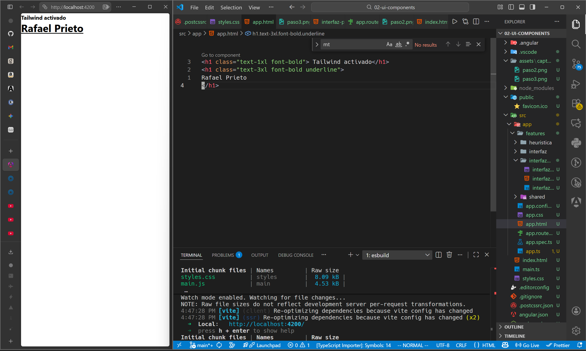
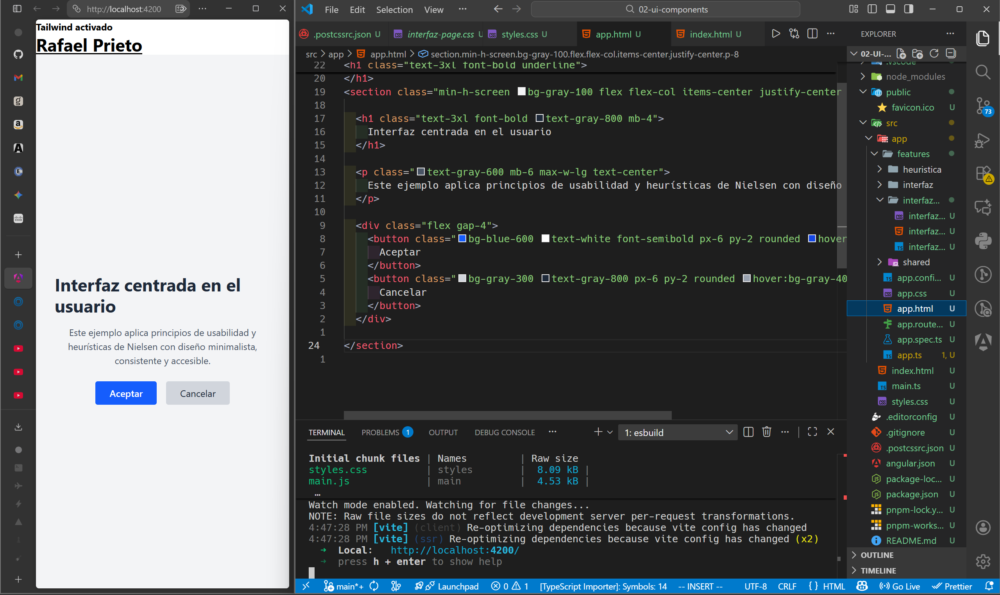
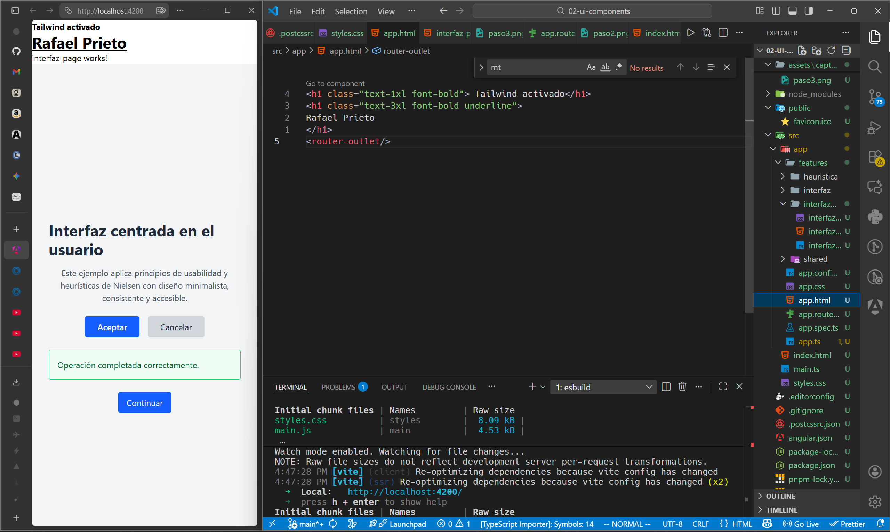

 Programación y Plataformas Web 

# Frameworks Web: Angular con tailwind

### ANGULAR

  

### TAILWIND CSS

  

## Práctica 1: Heuristica y Manejo de estilos 

### Autor

**Rafael Prieto**  
📧 pprietos@est.ups.edu.ec  
💻 GitHub: [raet0](https://github.com/raet0)

---

